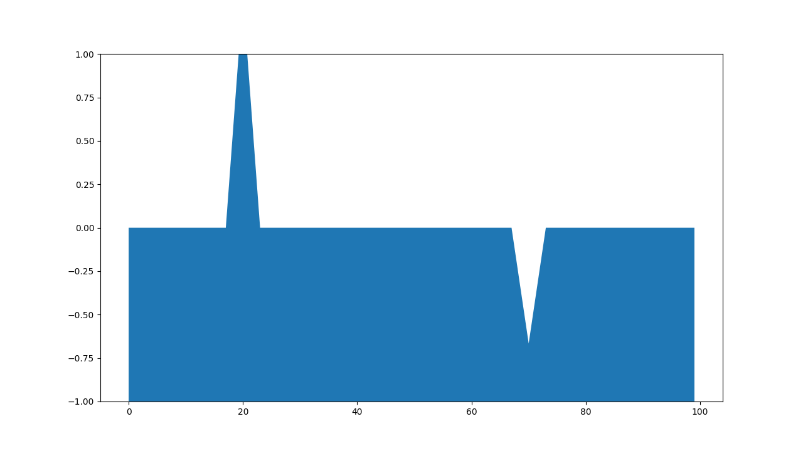

# ripple simulate, 1D, fixed end refrections.

This program simulates inertia and surface tension. I made this program in the early 2000s, it was a Java applet. I made this program in Python days ago to try to make it simple for better understanding. (2021.4.27)

# 固定端反射のpythonプログラム

これは固定端反射のpythonプログラムです。  
慣性と表面張力の単純処理を繰り返しているだけですが、波は右や左に進み、壁に当たってはね返ります。  
また左右からぶつかっても何事もなかったようにそれぞれの方向に進み続けます。  
このプログラムは、x軸の全ての点に対し、次の単純処理を繰り返しています。
* ①盛り上がったx軸の1点は、表面張力により元に戻ろうとする。  
* ②次も表面張力により元に戻ろうとするが、前回の移動で慣性が生じており、前回と同じ量移動しようとする力も加わる。(両方加算する)
* ③以降、②の繰り返し。

理屈は落下するボールを描画するのと同じです。ボールも最初は引力で落ち始め、次は引力+前回移動量(引力✕1)、次は引力+前回移動量(引力✕2)と、速度は上がっていきます。  
水面の場合、水面を通り越してしまうと力のかかる方向が逆になるので、結果は行ったり来たりの動きになります。  
固定端反射は、左右の端を常に0とすることで実現しています。  
(自由端反射にしたい場合、左右の端を常に隣と同じ値にする)

こういうやり方は、セルオートマトンというようです。

## ソースリストの説明

updateが上記の単純処理です。for文で新しいyの値を計算します。averageで平均をとっているのが表面張力、これに前回値kを加算してy1に新しいyの値を作っていきます。forループは左右の端を処理しません。このため左右の端は常に0となり、固定端反射となります。次に前回移動量kをy1-yとします。ここにあるifは、最初の波を穏やかにするために入れてあります。最後にy1をyに代入し、line.set_ydata(y)で線を更新します。

~~~ python
# fixed end refrections
# 固定端反射

import numpy as np
import matplotlib.pyplot as plt
import matplotlib.animation as animation

BOXWIDTH = 100

fig, ax = plt.subplots(figsize=(12.8, 7.2))

y = np.zeros(BOXWIDTH)

line, = ax.plot(y)
ax.set_ylim(-1,1)

y1 = y.copy()
k = y.copy()
y[20] = 4.0
y[70] = -2.0

def update(i):
    global y,y1,k
    for j in range(1,BOXWIDTH-1):
        y1[j] = np.average(y[j-1:j+2]) + k[j]
    if i > 4:
        k = y1 - y
    y = y1.copy()
    line.set_ydata(y)
    filbet = ax.fill_between(np.arange(BOXWIDTH), y, -1.0, animated=True, facecolor='C0')
    return line,filbet

ani = animation.FuncAnimation(fig, update, interval=50, blit=True, save_count=1400)
#ani.save("nami.mp4")
plt.show()
~~~
